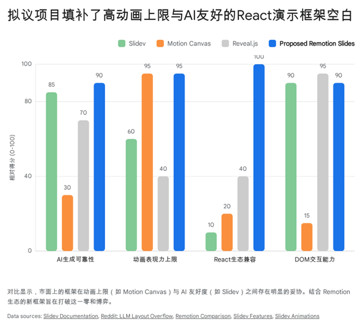
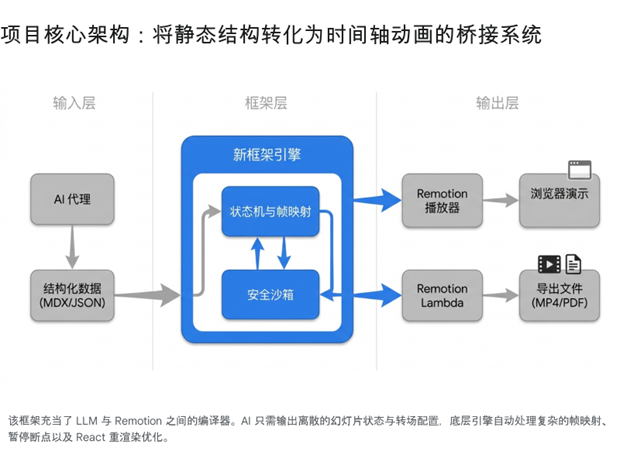

# **基于 React 与 Remotion 生态的 AI 驱动智能演示文稿框架研究与技术可行性分析**

随着生成式人工智能（Generative AI）大语言模型能力的飞跃，以及基于大模型的智能体（AI Agent）技术的不断演进，传统的图形用户界面（GUI）主导的演示文稿生成方式正面临着深刻的范式转换。根据“鸭子类型”（Duck Typing）的哲学原则，如果一个包含内嵌 CSS 与 JavaScript 的 HTML 文件具备逐页显示的功能、拥有完备的翻页与全屏切换逻辑，并且能够展示必要的动画效果，那么从受众体验和交付形式的角度来看，它在本质上就已经构成了一种现代化的演示文稿载体。

然而，在实际的工程实践中，直接指挥 AI Agent 编写单文件的、结构复杂的 React 或 HTML 代码以实现精美的动画效果，面临着巨大的系统性挑战。缺乏严格的工程规范、组件沙箱约束以及底层物理动画引擎的支撑，AI 生成的产物往往脆弱且难以维护。在这一背景下，利用 remotion.dev 这一能够通过 React 和 TypeScript 渲染高阶视频动画的底层引擎，来构建一个专为 AI 友好的、具备极高动画上限的交互式幻灯片（Slides）框架，成为了一个极具潜力的工程方向。本报告将针对这一构想，进行深度的市场生态位分析、技术可行性拆解、现有痛点洞察，并提供具有实操指导意义的系统演进路线图。

## **当前代码驱动演示文稿的生态位与竞品格局深度剖析**

在探索结合 Remotion 动画能力的幻灯片框架之前，必须精准定位该构想在当前前端开发与代码驱动演示文稿（Presentation-as-Code）领域中的生态位。当前市面上的代码驱动幻灯片框架主要分布在几个不同的技术象限中，它们在服务于开发者手动编码时表现优异，但在面对 AI 自动化生成以及极致的动效追求时，均暴露出深层的结构性痛点。

第一大阵营是以 Vue 生态为核心的主导者 Slidev。Slidev 是目前开发者社区中最具影响力的代码驱动幻灯片框架，其在 GitHub 上的星标数已经超过了四万五千颗，拥有极其活跃的开源社区体系 1。从架构特征来看，Slidev 采用了一种扩展的 Markdown 语法，底层基于高度优化的 Vite 构建工具，能够实现极速的热重载（HMR）2。在对 AI 智能体的友好度方面，Slidev 展现出了极高的前瞻性，其官方不仅提供了专门的 AI 技能（Skills）库，甚至针对大语言模型优化了特定的文档格式，使得智能体能够轻易解析其语法树、幻灯片分隔符以及基于 YAML 的 Frontmatter 页面配置 3。

然而，当试图将其作为高阶 AI 生成工具的基座时，Slidev 的局限性也同样显著。首先是技术栈摩擦力导致的生态隔离。根据最新的开发者生态调查，React 在 2024 年的全栈框架市场中占据了高达百分之五十二点九的绝对使用率 4，在开发者期望使用的框架中也稳居首位 5。在这种背景下，AI 代码生成模型往往默认将 React 作为输出基准 6。Slidev 深度绑定 Vue 体系，这意味着庞大的 React 生态组件（如各种复杂的交互式图表、企业级 UI 库）无法被无缝接入。其次，Slidev 的动画系统主要依赖于基于 CSS 的原子化类（如 UnoCSS）或 Vue 的内置过渡动画指令（例如 v-click、v-motion 以及 Shiki 的代码渐变引擎）7。这种机制处理简单的淡入淡出或平面位移游刃有余，但由于缺乏底层的插值计算和时间轴控制，它难以实现类似 Adobe After Effects 那样的复杂物理弹簧（Spring physics）、精确到帧的多层级并发动画，或是带有三维空间摄像机运动的电影级转场。此外，在 AI 自动生成的上下文中，Slidev 存在一个严重的静默错误痛点：由于 AI 在输出 Markdown 或组件时缺乏对最终浏览器渲染 DOM 尺寸的物理感知，经常导致幻灯片内容溢出（Layout Overflow）。这种溢出往往在导出 PDF 或进行实际全屏演示时才被发现，导致全自动化工作流受阻，需要开发者人工介入开发探针工具来进行二次校验 8。

第二大阵营则是专注于高精尖动画的 TypeScript 原生引擎，其中最典型的代表是 Motion Canvas。Motion Canvas 是一个基于 TypeScript 和原生 HTML Canvas API 的实时动画生成库，专门为生成技术解释、数学演示与教育类交互式动画而设计 9。它彻底抛弃了繁重的 DOM 树结构，采用单一的 \<canvas\> 元素进行渲染，从而提供了极高精度的帧控制与极佳的实时渲染性能 10。从动画表现力的角度来看，Motion Canvas 是极度优秀的，几乎可以满足所有关于复杂逻辑可视化的需求。

但是，将 Motion Canvas 纳入 AI 自动化生成演示文稿的流程中，会遭遇几乎无法逾越的代码范式鸿沟。Motion Canvas 采用了一种高度命令式（Imperative）和过程式（Procedural）的编程接口，其动画的时间流与状态流是通过 JavaScript 的生成器函数（Generator functions，即 yield\* 语法）来定义的 10。对于大语言模型而言，理解并生成声明式（Declarative）的组件树（如 HTML 或 React）相对容易，因为其结构与视觉层级高度对应；但要求模型去推理和生成包含复杂相对时间序列、需要精确控制挂起与恢复的命令式生成器代码，极其容易引发语法错误或逻辑死锁。并且，由于 Motion Canvas 完全基于 Canvas 绘制，它彻底脱离了前端领域长期积累的 DOM 生态环境，AI 无法调用现成的 React 库库来快速构建表格、表单或成熟的可视化看板 11。

第三大阵营是历史悠久的传统前端演示框架，如 Reveal.js。Reveal.js 作为极其成熟的 HTML 演示框架，稳定性极高且支持多种扩展 12。但是，它的核心架构依然建立在纯 Vanilla JavaScript 和 HTML 的基础上。如果要求 AI 智能体去生成一个复杂的 Reveal.js 幻灯片，AI 需要编写极其冗长、缺乏抽象的 HTML 嵌套标签。即便可以通过特定的封装让其支持 React 组件的插入，这种集成也往往需要处理复杂的 Portal 挂载机制，容易在状态共享和生命周期管理上引发难以调试的问题 12。类似于 MDX Deck 或 Spectacle 等原生 React 幻灯片库虽然在理念上更贴近现代前端，但长期以来的社区反馈表明，它们陷入了依赖老化、缺乏企业级维护的困境，其内部架构往往伴随着严重的性能依赖问题，已无法代表未来的发展演进方向 12。

通过对以上三大竞品阵营的剖析可以得出结论：用户的构想瞄准了一个高度精准且潜力巨大的空白生态位。市场急需一个基于纯 React 原生、能够承载电影级别复杂动画上限（如 Remotion 引擎所能提供的能力）、并且在系统设计之初就专门为大语言模型生成约束进行优化的声明式幻灯片框架。

| 框架特征比较矩阵 | 核心技术栈 | 动画表现力上限 | AI 代码生成难度 | 跨端输出能力（视频/PDF） |
| :---- | :---- | :---- | :---- | :---- |
| **Slidev** | Vue, Markdown, CSS | 中等（过渡与位移） | 低（有成熟生态约束） | 强（支持导出） |
| **Motion Canvas** | TypeScript, Canvas | 极高（细粒度物理引擎） | 极高（命令式生成器难推理） | 强（直接渲染视频） |
| **Reveal.js** | Vanilla JS, HTML | 低（依赖外部库） | 中（HTML冗余度高） | 弱（视频导出困难） |
| **拟议 Remotion 框架** | React, DOM/WebGL | 极高（Remotion插值与弹簧） | 低（通过严密DSL与组件沙箱） | 极强（原生并行视频编码） |

## **智能体生成 React 代码的痛点与防错沙箱的必要性**

在探讨如何整合 Remotion 之前，必须先理清为何直接让 AI Agent 编写单文件的、类似 PPT 的 React 页面难以形成工程规范。AI 在前端代码生成领域虽然取得了长足进步，但在处理涉及时间轴与复杂状态管理的应用时，依然存在不可忽视的系统性缺陷。

首先，大语言模型在组件架构设计上缺乏全局视野。当面对包含多个动画阶段、数据流动和用户交互的幻灯片需求时，AI 倾向于将所有逻辑堆砌在一个庞大的单文件组件中 13。它很少主动将复杂的业务逻辑抽象为自定义 Hooks，或者利用复合组件（Compound components）模式来提升代码的可读性与复用性 13。这种习惯会导致生成的幻灯片代码在初期勉强可运行，但随着动画阶段的增加，代码将迅速演变为无法维护的“面条代码”，一旦某一个动画钩子出现逻辑断层，整个页面的渲染就会崩溃。

其次，AI 难以精准掌控 React 的渲染生命周期与性能约束。在复杂的演示文稿中，控制不必要的重渲染（Re-renders）是保持动画流畅性的核心。然而，AI 在生成代码时，为了确保变量被捕获，往往会过度或错误地使用 useMemo 和 useCallback，甚至生成违反 ESLint 依赖数组规则的副作用钩子（useEffect）13。此外，React 开发工具生态在解答“为什么这个组件会重新渲染”的问题上长期存在局限，如果让 AI 自行处理深层嵌套的上下文（Context）默认值和闭包陷阱，会导致极难排查的性能黑洞 14。

更严重的是幻灯片内容的确定性验证问题。对于普通的后台数据接口代码，AI 可以通过编写并运行单元测试来验证逻辑的正确性（即 ReAct 循环中的 Observation 阶段）15。但在生成视觉向的幻灯片组件时，所谓的“正确”不仅意味着代码没有语法错误，更意味着视觉布局的和谐与动画时序的精准。AI Agent 目前无法像人类设计师一样，直观地“看”出文字是否溢出了特定的 div 容器，或者两个元素的入场动画是否发生了突兀的重叠。虽然可以通过 Playwright 等自动化工具进行截图对比测试，但这大大增加了 AI 迭代修复（Vibe Coding）的时间成本与算力消耗。

综上所述，完全放开手脚让 AI Agent 自由编写底层演示代码是不切实际的。如果要将精美的 React 动画技术引入幻灯片生成，必须在 AI Agent 和底层渲染引擎之间，建立一层强约束的“防御性组件沙箱”。在这个体系中，AI 不再负责发明新的动画逻辑机制，而是从预置的、经过极致性能优化与测试的原子级模块（如 \<SlideLayer\>, \<SpringText\>, \<DataVisualizationChart\>）中进行声明式的参数组装。

## **借助 Remotion 实现交互式幻灯片的技术机制与底层挑战**

remotion.dev 作为当前 React 生态中最强大的程序化视频构建框架，其核心理念是将视频编辑的时间轴概念转化为 React 的组件生命周期。它的主要产品定位是 B2B 视频基础设施，服务于自动化短视频生成、代码录制回放以及数据可视化视频导出 16。受其启发，利用 Remotion 构建幻灯片框架在底层机制上是具备理论可行性的，但必须跨越从连续视频流向离散交互转换的系统级鸿沟。

从可行性层面来看，Remotion 提供了极具价值的工具链。其核心的 @remotion/player 组件允许开发者在任何标准的 React 应用程序（如 Next.js 或 Vite 构建的应用）中嵌入一个视频播放器，该播放器并非播放预先渲染好的视频文件，而是根据当前的时间帧（Frame）实时渲染 React DOM 树 16。更为关键的是，Remotion 官方已经提供了高度完善的 @remotion/transitions 包，内建了专门为场景切换设计的 \<TransitionSeries\> 组件 18。通过该组件，开发者可以轻易实现类似传统 PPT 的翻页效果，例如使用 slide() 使得新页面推挤旧页面入场，或者通过自定义的着色器（Shader）与遮罩实现精美的星形渐变、3D 翻转等高级转场效果 19。在交互控制方面，Player 暴露了获取其实例引用的 PlayerRef API，开发者可以通过监听键盘的左右方向键或页面点击事件，调用诸如 playerRef.current.seekTo(frame)、pause() 以及 play() 等命令式函数，从而改变播放器的播放状态 17。结合播放器自带的 doubleClickToFullscreen 全屏切换属性 17，从表面上看，组装一个类似演示文稿的系统所需的基础砖块已经齐备。

然而，一旦深入到实际的工程构建与用户反馈层面，就会发现仅凭对 @remotion/player 的简单拼凑，根本无法直接产出符合生产规范的幻灯片项目。在社区实践中，试图强制使用 Remotion 处理离散交互的用户遇到了极其明显的痛点与阻碍。

第一个致命的痛点在于“基于帧的连续渲染”与“基于事件的离散状态”之间的架构范式冲突。传统幻灯片的逻辑是状态驱动的：展示第一页，等待用户点击，然后触发跳转至第二页的状态变更。而在 Remotion 的世界里，一切都是围绕时间轴线上的确定性计算展开的。所有精美的弹簧动画（Spring）和颜色插值（Interpolation）都强依赖于核心 Hook——useCurrentFrame() 提供的绝对帧数 10。如果要将一个 Remotion 视频模拟成幻灯片，意味着开发者（或者 AI）必须在编写代码时，精确规划每一页在整个时间轴上所占的起止帧。假设一页演示内容需要停留，开发者必须在特定帧数触发暂停，等待输入后再恢复播放以执行转场。在这个过程中，若因为浏览器的多进程渲染延迟（Compositor lag）或计算精度问题，导致 pause() 函数的调用晚了一帧，用户就会在屏幕上看到下一页幻灯片的突兀闪烁 22。这种要求精准帧数计算与全局时间线规划的工作，对于需要高度抽象能力的大语言模型来说，不仅计算极易出错，而且一旦需要增删中间某一页，所有后续页面的绝对帧序号都需要全部重算，这彻底破坏了代码的可维护性。

第二个痛点来源于 Remotion 严苛的渲染安全原则与多线程隔离限制。为了确保在使用 Remotion Lambda 等云端方案导出视频时能够实现极速的多线程并发渲染，Remotion 引擎强制要求所有的动画逻辑必须与真实时间或异步状态解耦 21。如果你的 React 组件中包含了由于异步数据加载引发的非确定性状态，或者使用了不受控的延时操作（setTimeout），在多线程视频打包过程中就会发生严重的帧顺序错乱和闪烁（Flickering）21。虽然可以通过设置单线程并发（--concurrency=1）来规避部分问题，但那将使得云端渲染的速度大幅降低，完全丧失了 Remotion 的性能优势 21。这意味着在为 AI Agent 构建幻灯片框架时，必须对所有的网络请求、图片与字体加载进行极其严密的生命周期拦截，使用 delayRender 和 continueRender 等专用机制来冻结渲染引擎，直到所有前端资产就绪 21。对于未加约束的通用 AI Agent，要求其在编写普通 React 组件的同时，时刻兼顾这些反直觉的底层多线程安全准则，无疑是一场灾难。

因此，用户的洞察是非常准确的：尽管底层技术可以渲染出极为精美的画面，但依靠指挥 AI 去零散地调用 Remotion API 编写幻灯片，根本无法形成工程规范。业界确实需要一套更高级的抽象。

## **拟议项目的决定性改善空间与市场存在的必要性**

面对上述痛点，如果能够构建出一个架构设计良好的、无缝兼容 Remotion 生态的 PPT-like 框架，该项目是否还具有站稳脚跟的空间与必要性？答案不仅是肯定的，而且这个生态位目前拥有极高的战略价值。

首先，从 Remotion 官方的演进路径来看，他们已经明确划定了业务边界。在关于“Remotion 是否会亲自打造直接面向消费者的动态图形工具”这一问题上，官方在其公开文档中给出了明确的否定回答（"Is Remotion building Lovable for Motion Graphics? The answer is no\!"）23。官方表示，他们的核心竞争力在于构建坚实的底层视频渲染技术与编译器设施，并不擅长直接应对 C 端用户的交互痛点和复杂的垂直业务逻辑流。他们强烈鼓励并且需要开源社区与企业基于这套基础设施，去开发带有特定交互界面的应用、自动化视频生成器以及演示工具 23。这种官方“让出赛道”的声明，为本项目提供了最权威的存在合理性背书——你所构想的项目正是底层生态极其渴望的上层杀手级应用（Killer App）。

其次，该项目具备在逻辑抽象上做出决定性改善的巨大空间。本项目的核心技术壁垒不应是仅仅提供几个动画组件，而是必须充当一个“降维编译器”。它的核心使命是剥离掉 Remotion 对于精确时间帧和连续时间轴的强依赖，向 AI Agent 和开发者暴露一套完全声明式（Declarative）、以离散状态为核心的 API 接口。在这个抽象层之上，AI 智能体只需要输出类似如下的结构化意图：

“这里有一张幻灯片，包含两段文字和一个图表。希望它以带有物理弹性的方式入场，并在演示完成时以 3D 翻转的形式切换到下一页。”

而在编译器内部，框架会自动进行一系列极为复杂的数学换算：它负责动态分配各页面的持续帧数计算、自动处理各个 \<TransitionSeries.Sequence\> 之间的重叠连接，并在编译输出结果中隐式挂载针对键盘事件和点击事件的断点拦截逻辑。这种设计，让大模型只做它擅长的语义与结构排版，而将它不擅长的精密算术和多线程防抖交给底层框架的运行时（Runtime）处理，彻底消除了“帧数计算错误”的隐患。

再者，该项目在最终制品的跨介质交付（Write Once, Render Anywhere）能力上能够实现对现有竞品的降维打击。借助 Remotion 强大的服务端与云计算生态，本项目不仅能输出一个在浏览器里点点划划的 HTML 播放页面，更能够利用 Remotion Lambda 分布式渲染引擎，将其无缝一键导出为帧率极高（例如 60 FPS）、音轨绝对同步的纯正 MP4 视频，或者是高清的 PDF 文档 16。在这个短视频传播和知识快速分发成为主流的时代，一种既能像幻灯片一样在会议现场进行交互演讲，又能直接转化为高质量预录制视频的技术方案，具有无与伦比的商业传播价值。这种多模态的一致性交付能力，是依赖浏览器截图插件的 Slidev 或者完全剥离 DOM 的 Motion Canvas 所无法企及的。

## **具有可行性的分阶段产品演进路线图（Roadmap）**

为了将这一极具前景的构想稳步推进为可落地的工程产品，同时规避在开发初期引入过多复杂度，建议采用自底向上、逐步放开 AI 权限的四阶段实施路径。

### **第一阶段：核心管线与状态映射层构建 (Core Orchestration Framework)**

在引入任何 AI 要素之前，首先必须建立稳固的基础设施，解决离散交互与连续帧动画之间的转换矛盾。

1. **定义声明式幻灯片原语（API Primitives）**：设计一套高度抽象的 React API，如 \<Deck\>, \<Slide\>, \<AnimateIn\>。开发者不再接触帧数，只需指定时长或入场顺序。  
2. **构建状态-帧编译器（State-to-Frame Compiler）**：这是框架的心脏。它需要在渲染周期前，遍历整个幻灯片组件树，自动累加时长，生成一张隐藏的全局关键帧时间表（Timeline Map）。  
3. **深度定制播放器（Custom Player Overrides）**：对 @remotion/player 进行高阶封装。利用内部的时间表，实现针对键盘按键（方向键、空格键）或鼠标点击事件的全局拦截监听。当触发“下一页”时，调用内部计算好的下一个锚点区间，配合平滑的补间函数调用 playerRef.current.seekTo() 和 play()，实现精准的播放与暂停控制。

### **第二阶段：模型上下文协议与防错沙箱集成 (AI-First DSL & MCP Integration)**

基础管线稳定后，核心任务是规范 AI Agent 的生成行为，防止其输出非理性的渲染代码。

1. **制定领域特定语言（DSL）**：放弃让 AI 直接生成原生 React 函数。采用基于高度约束的 Markdown（如 MDX）或者严密的 JSON Schema 作为中间介质，由前端框架负责将这些数据水合（Hydration）为最终的 Remotion 组件。  
2. **构建严格的防错组件沙箱**：封锁所有直接使用 useEffect 或原生异步请求的通道。框架需内置处理过 delayRender 的高级组件，例如能够确保在文本与图片完全加载后才开始动画的 \<SafeImage\> 和 \<TypographyBox\>，从根本上阻断多线程渲染时的闪烁问题。  
3. **Model Context Protocol (MCP) 服务器开发**：将该框架的设计哲学、组件 Schema 约束、防溢出最佳实践等知识封装为一个符合业界标准的 MCP Server。通过这种方式（类似于官方为 Remotion 文档建立的向量知识库做法 25），主流的智能编辑器或工作流代理（如 Cursor, Claude Code）能够在理解框架独有规则的前提下，精准生成符合规范的结构化幻灯片代码。

### **第三阶段：表现层生态扩展与电影级资产储备 (Cinematic Asset Ecosystem)**

当 AI 能够稳定输出基础框架代码后，下一步是大幅拔高演示文稿的视觉上限，确立竞争优势。

1. **融合高阶转场能力**：深度适配 @remotion/transitions，引入 3D 立方体翻转、非线性遮罩擦除（Iris Wipe）、物理阻尼动画等极具视觉冲击力的页面级过渡效果。  
2. **开发数据可视化组件套件**：这不仅是简单的静态图表。可以借鉴社区中类似 remotion-bits 的微型模块化思路 26，打造一系列能够在进入画面时动态生长、伴随音乐节拍或数据节点自动演算路径的高级可视化图表组件，极大地丰富演示内容的专业感。  
3. **智能化排版引擎调优**：引入基于 Canvas 或特定算法的自动缩放文本（Auto-fit Text）机制，彻底解决大语言模型生成长段落导致的排版溢出问题，提升无人工干预情况下的自动化成品率。

### **第四阶段：云端闭环与多端交付分发 (Cloud Rendering & Omni-channel Distribution)**

项目的最终愿景是成为智能内容分发的综合平台。

1. **无缝对接 Serverless 渲染引擎**：全面适配 Remotion Lambda，允许用户在界面上点击一个按钮，即可将这份交互式幻灯片投递至 AWS 等云端分布式节点，实现近乎实时的高清 MP4 视频导出。  
2. **构建双向互动与演讲者模式**：利用框架已剥离的状态机，可以进一步开发配套的“控制端”。借助 WebSockets 或 BroadcastChannel，实现一台设备控制主屏幕动画播放，另一台设备展示包含大模型生成的辅助演讲注释和时间把控的仪表盘，完成专业级演示体验的最后一块拼图。

## **总结**

综上所述，将 remotion.dev 引擎引入并改造成适应 AI 生成的交互式幻灯片框架，是一项在技术逻辑上极其自洽、在市场需求中极具潜力的工程。它洞察并切中了目前开源世界中缺乏一款能兼顾“极高动画渲染表现力”、“与原生 React 生态无缝对接”以及“对大模型生成高度约束友好”的演示工具这一痛点。只要能够在底层建立起精准的时序映射编译器，在上层构建严密的安全组件沙箱和 MCP 协议对接，这一产品无疑能够在代码驱动内容的生态中占据极为重要且不可替代的一席之地，真正开启人工智能参与辅助的高清、多模态演示生产力时代。

## **Works cited**

1. viktorbezdek/awesome-github-projects, accessed April 17, 2026, [https://github.com/viktorbezdek/awesome-github-projects](https://github.com/viktorbezdek/awesome-github-projects)  
2. Why Slidev | Slidev, accessed April 17, 2026, [https://sli.dev/guide/why](https://sli.dev/guide/why)  
3. Work with AI | Slidev, accessed April 17, 2026, [https://sli.dev/guide/work-with-ai](https://sli.dev/guide/work-with-ai)  
4. Top Frameworks for JavaScript App Development in 2025 \- Strapi, accessed April 17, 2026, [https://strapi.io/blog/frameworks-for-javascript-app-developlemt](https://strapi.io/blog/frameworks-for-javascript-app-developlemt)  
5. Front-end frameworks popularity (React, Vue, Angular and Svelte) \- GitHub Gist, accessed April 17, 2026, [https://gist.github.com/tkrotoff/b1caa4c3a185629299ec234d2314e190](https://gist.github.com/tkrotoff/b1caa4c3a185629299ec234d2314e190)  
6. Is the future of React still as bright in 2025 as it was before? : r/reactjs \- Reddit, accessed April 17, 2026, [https://www.reddit.com/r/reactjs/comments/1kir0pi/is\_the\_future\_of\_react\_still\_as\_bright\_in\_2025\_as/](https://www.reddit.com/r/reactjs/comments/1kir0pi/is_the_future_of_react_still_as_bright_in_2025_as/)  
7. Animation \- Slidev, accessed April 17, 2026, [https://sli.dev/guide/animations.html](https://sli.dev/guide/animations.html)  
8. When AI generates Slidev slides, layout overflow is easy to miss — so I built a checker : r/LLMDevs \- Reddit, accessed April 17, 2026, [https://www.reddit.com/r/LLMDevs/comments/1qf87f4/when\_ai\_generates\_slidev\_slides\_layout\_overflow/](https://www.reddit.com/r/LLMDevs/comments/1qf87f4/when_ai_generates_slidev_slides_layout_overflow/)  
9. Creating Animations and Videos with Code: Remotion vs. Motion Canvas | CamelEdge, accessed April 17, 2026, [https://cameledge.com/post/productivity/remotion-vs-motion-canvas](https://cameledge.com/post/productivity/remotion-vs-motion-canvas)  
10. How does Remotion compare to Motion Canvas?, accessed April 17, 2026, [https://www.remotion.dev/docs/compare/motion-canvas](https://www.remotion.dev/docs/compare/motion-canvas)  
11. Top 10 Pre-Built React Frontend UI Libraries for 2025 – Blog \- Supernova.io, accessed April 17, 2026, [https://www.supernova.io/blog/top-10-pre-built-react-frontend-ui-libraries-for-2025](https://www.supernova.io/blog/top-10-pre-built-react-frontend-ui-libraries-for-2025)  
12. Which of the various JS-based presentation tools are still maintained and usable in 2025?, accessed April 17, 2026, [https://www.reddit.com/r/learnjavascript/comments/1mgghuz/which\_of\_the\_various\_jsbased\_presentation\_tools/](https://www.reddit.com/r/learnjavascript/comments/1mgghuz/which_of_the_various_jsbased_presentation_tools/)  
13. AI Coding in React: What You Still Need to Know \- Certificates.dev, accessed April 17, 2026, [https://certificates.dev/blog/ai-coding-in-react-what-you-still-need-to-know](https://certificates.dev/blog/ai-coding-in-react-what-you-still-need-to-know)  
14. Is there any pain point you find inconvenient when developing with React? \- Reddit, accessed April 17, 2026, [https://www.reddit.com/r/reactjs/comments/1mw5mpv/is\_there\_any\_pain\_point\_you\_find\_inconvenient/](https://www.reddit.com/r/reactjs/comments/1mw5mpv/is_there_any_pain_point_you_find_inconvenient/)  
15. LLM Agents \- Prompt Engineering Guide, accessed April 17, 2026, [https://www.promptingguide.ai/research/llm-agents](https://www.promptingguide.ai/research/llm-agents)  
16. @remotion/player, accessed April 17, 2026, [https://www.remotion.dev/player](https://www.remotion.dev/player)  
17.
18.
19. Custom presentations | Remotion | Make videos programmatically, accessed April 17, 2026, [https://www.remotion.dev/docs/transitions/presentations/custom](https://www.remotion.dev/docs/transitions/presentations/custom)  
20. slide() | Remotion | Make videos programmatically, accessed April 17, 2026, [https://www.remotion.dev/docs/transitions/presentations/slide](https://www.remotion.dev/docs/transitions/presentations/slide)  
21. Flickering | Remotion | Make videos programmatically, accessed April 17, 2026, [https://www.remotion.dev/docs/flickering](https://www.remotion.dev/docs/flickering)  
22. rnd-player/RESEARCH.md at main \- GitHub, accessed April 17, 2026, [https://github.com/OpenIPC/rnd-player/blob/main/RESEARCH.md](https://github.com/OpenIPC/rnd-player/blob/main/RESEARCH.md)  
23. Is Remotion building Lovable for Motion Graphics?, accessed April 17, 2026, [https://www.remotion.dev/docs/lovable-for-motion-graphics](https://www.remotion.dev/docs/lovable-for-motion-graphics)  
24. Blog | Remotion | Make videos programmatically, accessed April 17, 2026, [https://www.remotion.dev/blog/page/2](https://www.remotion.dev/blog/page/2)  
25. Remotion's Model Context Protocol | Remotion | Make videos programmatically, accessed April 17, 2026, [https://www.remotion.dev/docs/ai/mcp](https://www.remotion.dev/docs/ai/mcp)  
26. av/remotion-bits: Building blocks for your videos. \- GitHub, accessed April 17, 2026, [https://github.com/av/remotion-bits](https://github.com/av/remotion-bits)
